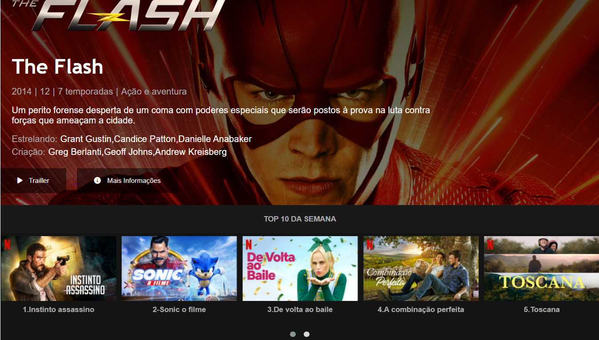

## Descrição do Desafio

Reconstruir a interface do principal site de streaming mundial, utilizando HTML5, CSS3, JavaScript e uso de Flexbox, uma das abordagens de posicionamento de elementos mais utilizadas quando se trata de responsividade.

## Links Úteis

- [Repositório no GitHub](https://github.com/felipeAguiarCode/netflix-clone) (implementação de referência)

### Requisitos:

* [HTML5 básico](https://www.w3schools.com/html/)
* [CSS3 básico](https://developer.mozilla.org/pt-BR/docs/Web/CSS)
* [JAVASCRIPT básico]([JavaScript básico - Aprendendo desenvolvimento web | MDN (mozilla.org)](https://developer.mozilla.org/pt-BR/docs/Learn/Getting_started_with_the_web/JavaScript_basics))

## Minhas contribuições ao código original foram:

1. Página inicial.
2. Página de login.
3. Página principal com o tema da série The Flash, como logo responsivo.
4. Responsividade para desktop e mobile.
5. Botões para download nas lojas Google Play e App Store.
6. Top 10 da semana com capas e legendas.
7. Tela de trailler da série The Flash.

## 👍 Fique a vontade para modificar 👍

